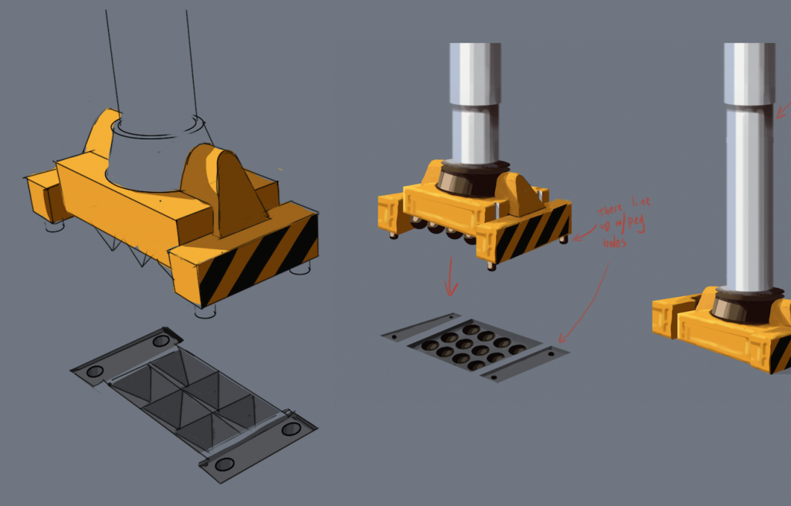

# HackOut Game

Locked away in the world's most advanced prison, your only chance of escape is to hack into the system.

hackOut is a fun and exciting way to learn to read and manipulate JavaScript code right on your iPad.

# Disclaimer

This is still very much in production, not a complete game.

I haven't played with this in a little bit and just tried opening it in Unity 5 - it's medium borked. That's why I've only included the scripts, not the prefabs and everything else. Once unborked, I'll include everything else.

# Screenshots and Concept Art

